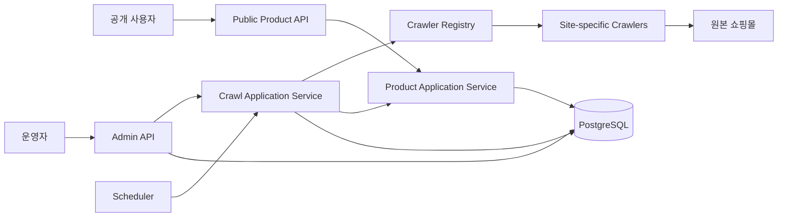

# Vintage Hub Backend Architecture

작성일: 2026-05-14

## 목적

이 문서는 Vintage Hub 백엔드가 MVP에서 어떤 구조로 성장해야 하는지 정한다. 현재 프로젝트는 단일 Spring Boot 애플리케이션이고, 초기 구현은 크롤링 요청 API만 존재한다. 따라서 처음부터 마이크로서비스나 복잡한 프레임워크를 도입하지 않고, 단일 모듈 안에서 경계를 명확히 나누는 방식으로 시작한다.

## 전제

- 런타임은 Java 25, Spring Boot 4, Gradle을 사용한다.
- 데이터 저장소는 PostgreSQL을 기본으로 한다.
- 스키마 변경은 애플리케이션 코드와 함께 버전 관리되는 DB 마이그레이션으로 적용한다.
- MVP의 핵심은 공개 상품 검색, 상품 상세 조회, 운영자용 크롤링 관리다.
- 크롤링 대상은 공개 상품 페이지이며, robots 정책과 사이트별 수집 정책을 준수한다.
- 일반 사용자 로그인, 관심 상품, 알림, 구매 대행, Elasticsearch/OpenSearch는 MVP 범위에서 제외한다.

## 성공 기준

- 상품 조회 API는 크롤러 구현과 독립적으로 읽기 모델을 제공한다.
- 사이트별 크롤러는 공통 계약을 따르되, 파싱 세부사항은 사이트별 코드에 격리된다.
- 크롤링 실행, 파싱 실패, 품절 갱신, 리뉴얼 의심 상태를 운영자가 추적할 수 있다.
- PostgreSQL 인덱스만으로 MVP 검색과 필터링을 감당한다.
- 단일 애플리케이션 구조를 유지하되, 나중에 크롤러 워커나 검색 인프라를 분리할 수 있는 경계를 남긴다.
- 크롤링 실행은 중복 실행, 장시간 트랜잭션, 요청 스레드 점유 없이 처리된다.
- 장애 분석에 필요한 traceId, 상태 조회, 기본 지표가 MVP부터 남는다.

## 선택한 접근

### 권장안: 모듈러 모놀리스

MVP는 단일 Spring Boot 애플리케이션 안에서 기능별 패키지를 분리하는 모듈러 모놀리스로 간다.

장점은 구현과 배포가 단순하고, 트랜잭션 경계가 명확하며, 초기 운영 비용이 낮다는 점이다. 크롤링, 상품 조회, 운영자 인증을 같은 애플리케이션에서 시작하되 패키지와 인터페이스를 나누면 이후 워커 분리도 어렵지 않다.

단점은 크롤링 부하가 API 응답에 영향을 줄 수 있다는 점이다. 이를 막기 위해 크롤링은 요청 스레드에서 직접 실행하지 않고, `CrawlRun` 기록을 만든 뒤 백그라운드 작업으로 처리한다.

MVP의 백그라운드 작업은 애플리케이션 내부의 `TaskExecutor`와 스케줄러로 시작한다. 별도 워커나 메시지 브로커는 운영 병목이 확인되기 전까지 도입하지 않는다. 단, 외부 HTTP 요청, 파싱, 저장은 재시도와 실패 기록이 가능한 작은 작업 단위로 나누고, 같은 사이트의 크롤링이 동시에 실행되지 않도록 DB 기반 실행 잠금을 둔다.

### 보류안: 마이크로서비스

크롤러, API, 관리자 서비스를 처음부터 분리하는 방식이다. 장기적으로는 확장성이 좋지만 MVP에는 배포, 인증, 관측, 장애 대응 비용이 과하다. 사이트별 수집 안정성이 검증되기 전까지는 선택하지 않는다.

### 보류안: 검색 엔진 우선 도입

Elasticsearch/OpenSearch를 먼저 붙이는 방식이다. 검색 품질과 확장성은 좋지만, MVP의 필터는 사이트, 카테고리, 실측, 가격, 품절 상태 중심이므로 PostgreSQL 인덱스와 쿼리 최적화로 시작한다. 검색어 랭킹, 형태소 분석, 대규모 색인이 필요해지는 시점에 별도 도입한다.

## 전체 구조



백엔드는 다음 책임으로 나눈다.

- 공개 API: 상품 목록, 상품 상세, 필터 조회, 상세 진입 시 품절 재확인 트리거
- 운영자 API: 로그인, 사이트 관리, 크롤링 실행 요청, 크롤링 상태와 이슈 조회
- 크롤링 애플리케이션: 실행 기록 생성, 사이트별 크롤러 선택, 수집 결과 저장, 실패 기록
- 작업 실행기: 수동 실행, 스케줄 실행, 품절 재확인 작업을 요청 스레드 밖에서 실행
- 사이트별 크롤러: HTML 요청, 인코딩 처리, 목록/상세 파싱, 원본 데이터 정규화
- 상품 애플리케이션: 상품 업서트, 실측 저장, 카테고리 매핑, 품절 TTL 판단
- 저장소: 상품, 사이트, 크롤링 실행, 이슈, 운영자 계정 저장

## 패키지 구조

초기에는 단일 Gradle 모듈을 유지하고, `com.joypeb.vintagehub` 아래에 기능별 패키지를 둔다.

```text
com.joypeb.vintagehub
├── admin
│   ├── api
│   ├── application
│   ├── domain
│   └── persistence
├── product
│   ├── api
│   ├── application
│   ├── domain
│   └── persistence
├── crawl
│   ├── api
│   ├── application
│   ├── domain
│   ├── persistence
│   └── site
│       └── rocketsalad
├── measurement
│   ├── application
│   └── domain
├── common
│   ├── config
│   ├── error
│   └── time
└── VintageHubBeApplication
```

패키지 규칙은 다음과 같다.

- `api`는 HTTP 요청/응답 DTO와 컨트롤러만 둔다.
- `application`은 유스케이스를 조합한다. 트랜잭션 경계는 이 계층에 둔다.
- `domain`은 상태, 정책, 값 객체를 둔다. Spring MVC나 JPA 세부사항에 의존하지 않는다.
- `persistence`는 JPA 엔티티, Repository, 쿼리 구현을 둔다.
- `crawl.site.<siteCode>`는 사이트별 파서와 URL 규칙을 격리한다.
- `common`은 실제로 둘 이상의 기능에서 쓰일 때만 만든다.

## Enum과 DTO 배치

Enum은 그 값이 표현하는 책임의 소유 패키지에 둔다. 모든 enum을 한 곳에 모으는 `common.enums` 같은 패키지는 만들지 않는다.

- 도메인 상태와 정책을 표현하는 enum은 해당 기능의 `domain`에 둔다.
  - 예: `product.domain.StockStatus`
  - 예: `crawl.domain.CrawlerStatus`
  - 예: `crawl.domain.CrawlRunStatus`
  - 예: `crawl.domain.CrawlIssueType`
  - 예: `measurement.domain.MeasurementSource`
- HTTP 요청/응답에만 필요한 enum은 해당 기능의 `api`에 둔다.
  - 예: `product.api.ProductSort`
  - 예: `product.api.ProductSearchFilter`
- DB 저장 방식에만 필요한 값은 `persistence`에 둔다. 다만 도메인 상태와 같은 의미라면 별도 persistence enum을 만들지 않고 domain enum을 매핑한다.
- 사이트별 파싱에만 필요한 enum은 `crawl.site.<siteCode>` 아래에 둔다.
  - 예: `crawl.site.rocketsalad.RocketSaladCategory`

DTO도 경계별로 나눈다.

- HTTP DTO는 `api`에 둔다.
  - 예: `ProductListResponse`, `ProductDetailResponse`, `RequestCrawlRunResponse`
  - 컨트롤러 하나에서만 쓰는 작은 DTO는 컨트롤러 내부 `record`로 시작해도 된다.
- 유스케이스 입력/출력 모델은 필요할 때 `application`에 둔다.
  - 예: `SearchProductsCommand`, `ProductDetailResult`, `CrawlRunRequest`
  - 컨트롤러 DTO를 서비스 계층까지 그대로 넘기지 않는다.
- 외부 사이트 파싱 결과는 `crawl.site.<siteCode>` 또는 `crawl.application`의 내부 모델로 둔다.
  - 예: `RocketSaladListItem`, `CrawledProductDetail`
- JPA 엔티티는 DTO로 취급하지 않고 `persistence`에 둔다.

## Domain과 DTO 변환

도메인은 API DTO를 알지 않는다. 변환 방향은 항상 바깥 계층이 안쪽 계층을 감싸는 방식으로 둔다.

```text
HTTP Request DTO
  -> Application Command
  -> Domain / Repository
  -> Application Result 또는 Read Model
  -> HTTP Response DTO
```

구체적인 규칙은 다음과 같다.

- `domain` 객체 안에 `toResponse()`, `toDto()` 같은 API 변환 메서드를 만들지 않는다.
- `api` 계층에서 `Response.from(result)` 같은 정적 팩터리로 응답 DTO를 만든다.
- 변환이 단순하면 DTO의 `from` 메서드로 처리한다.
- 변환이 길어지거나 여러 응답에서 재사용되면 같은 `api` 패키지에 mapper 클래스를 둔다.
- 목록 조회처럼 도메인 행위를 거의 쓰지 않는 읽기 API는 JPA projection이나 application read model을 바로 응답 DTO로 바꿔도 된다.
- 쓰기 유스케이스는 API DTO를 application command로 변환한 뒤 서비스에 넘긴다.

예시는 다음과 같다.

```java
// product.api
record ProductDetailResponse(
    Long id,
    String name,
    String stockStatus
) {
    static ProductDetailResponse from(ProductDetailResult result) {
        return new ProductDetailResponse(
            result.id(),
            result.name(),
            result.stockStatus().name()
        );
    }
}
```

```java
// product.application
record ProductDetailResult(
    Long id,
    String name,
    StockStatus stockStatus
) {
}
```

이렇게 하면 도메인은 HTTP 표현 방식에 묶이지 않고, API 응답 형식 변경도 `api` 계층에서 처리할 수 있다.

## 핵심 도메인

### Product

정규화된 상품이다. 사이트와 원본 상품 식별자 조합이 자연 키다.

주요 필드는 다음을 기준으로 한다.

- `siteId`
- `sourceProductId`
- `name`
- `originalPrice`
- `salePrice`
- `stockStatus`
- `description`
- `detailUrl`
- `thumbnailImageUrl`
- `sourceCategoryName`
- `standardCategory`
- `standardSubCategory`
- `categoryConfidence`
- `collectedAt`
- `lastSeenAt`
- `availabilityCheckedAt`

품절 상태는 boolean이 아니라 `AVAILABLE`, `SOLD_OUT`, `UNKNOWN`, `CHECK_FAILED` enum으로 둔다.

### ProductMeasurement

실측은 상품의 고정 컬럼으로 두지 않는다. 사이트마다 항목이 다르고, 파싱 신뢰도와 운영자 보정 이력이 필요하기 때문이다.

주요 필드는 다음과 같다.

- `productId`
- `part`
- `valueCm`
- `rawText`
- `confidence`
- `source`
- `updatedAt`

### CrawlSite

크롤링 대상 사이트와 운영 정책을 저장한다.

주요 필드는 다음과 같다.

- `code`
- `displayName`
- `baseUrl`
- `platform`
- `crawlIntervalMinutes`
- `crawlerStatus`
- `lastCrawledAt`
- `lastChangedAt`
- `lastChangeDetectedAt`
- `consecutiveNoChangeCount`

### CrawlRun

크롤링 실행 단위다. 운영자가 수동 실행하거나 스케줄러가 자동 실행할 때마다 생성한다.

주요 필드는 다음과 같다.

- `siteId`
- `triggerType`
- `status`
- `startedAt`
- `finishedAt`
- `foundCount`
- `createdCount`
- `updatedCount`
- `failedCount`
- `message`

### CrawlIssue

파싱 실패, 차단, 리뉴얼 의심, 폐쇄 의심 같은 운영 이슈를 기록한다.

주요 필드는 다음과 같다.

- `siteId`
- `crawlRunId`
- `issueType`
- `severity`
- `sourceUrl`
- `message`
- `resolvedAt`

### AdminUser

운영자 계정이다. 회원가입은 제공하지 않고, 사전 발급된 계정만 사용한다. 비밀번호는 해시로 저장하고 운영자 API는 JWT 인증을 요구한다.

## 데이터 흐름

### 목록 크롤링

1. 스케줄러 또는 운영자 API가 `CrawlRun` 생성을 요청한다.
2. `CrawlApplicationService`가 대상 사이트 상태를 확인한다.
3. `CrawlerRegistry`가 `siteCode`에 맞는 사이트별 크롤러를 선택한다.
4. 사이트별 크롤러가 목록 페이지를 가져오고 상품 후보를 파싱한다.
5. 정규화된 후보로 fingerprint를 만들고 변경 여부를 판단한다.
6. 신규 또는 변경된 상품만 상세 수집 대상으로 넘긴다.
7. 상품 저장 서비스가 `siteId + sourceProductId` 기준으로 업서트한다.
8. 실행 결과와 실패 정보를 `CrawlRun`, `CrawlIssue`에 기록한다.

### 상품 상세 조회

1. 공개 API가 DB의 상품 상세를 반환한다.
2. 상품의 `availabilityCheckedAt`과 `stockStatus`로 TTL을 판단한다.
3. TTL이 만료된 경우 백그라운드 품절 재확인 작업을 요청한다.
4. 재확인 결과가 바뀌면 DB를 갱신한다.
5. MVP에서는 SSE가 필요한 화면에서만 상태 변경 이벤트를 제공한다.

### 운영자 크롤링 실행

1. 운영자가 JWT로 인증한 뒤 특정 사이트 크롤링 실행을 요청한다.
2. API는 같은 사이트에 `PENDING` 또는 `RUNNING` 실행이 있는지 확인한다.
3. 실행 중인 작업이 있으면 새 실행을 만들지 않고 기존 `CrawlRun`을 반환하거나 `409 Conflict`를 반환한다.
4. 새 실행이 가능하면 `CrawlRun`을 만들고 요청을 오래 붙잡지 않은 채 `202 Accepted`를 반환한다.
5. 백그라운드 작업이 `CrawlRun` 상태를 `PENDING`, `RUNNING`, `SUCCEEDED`, `FAILED`, `CANCELLED`로 갱신한다.
6. 운영자 화면은 실행 목록과 이슈 목록을 조회해 상태를 보여준다.

중복 실행 방지는 애플리케이션 메모리 락에만 의존하지 않는다. 단일 인스턴스로 시작하더라도 배포 재시작과 향후 다중 인스턴스를 고려해 DB unique constraint, pessimistic lock, PostgreSQL advisory lock 중 하나를 사용한다.

## 크롤러 설계

사이트별 크롤러는 다음 계약을 따른다.

```text
SiteCrawler
├── supports(siteCode)
├── fetchList(site, cursor)
├── fetchDetail(site, productRef)
└── checkAvailability(site, productRef)
```

구현 원칙은 다음과 같다.

- HTML 요청과 파싱은 사이트별 패키지에 둔다.
- 인코딩, URL 정규화, robots 확인, 요청 딜레이는 공통 인프라에서 제공한다.
- CAPTCHA, 로그인, 403, 429가 반복되면 우회하지 않고 수집을 중단한다.
- 목록 수집 결과는 상세 수집 전에 중복 제거한다.
- 상세 파싱 실패는 상품 저장 실패와 분리해 `CrawlIssue`로 남긴다.

로켓샐러드는 `crawl.site.rocketsalad` 패키지에서 시작한다. MakeShop 기반이고 EUC-KR 인코딩을 처리해야 하므로 인코딩 변환과 모바일 상세 URL 규칙을 해당 패키지에 둔다.

## 검색과 조회

MVP 검색은 PostgreSQL 중심으로 구현한다.

목록 필터는 다음 조건을 우선 지원한다.

- 사이트
- 표준 대분류
- 표준 소분류
- 실측 범위
- 가격 범위
- 품절 상태
- 최신 크롤링 순 정렬

인덱스는 실제 쿼리를 기준으로 추가한다. 초기 후보는 다음과 같다.

- `product(site_id, collected_at desc)`
- `product(standard_category, standard_sub_category, collected_at desc)`
- `product(stock_status, collected_at desc)`
- `product(original_price)`
- `product(sale_price)`
- `product_measurement(part, value_cm)`
- `product(site_id, source_product_id)` unique

키워드 검색은 단순 `LIKE`나 PostgreSQL full-text search로 시작할 수 있다. 다만 한국어 상품명, 브랜드명, 부분 문자열, 오타 검색은 PostgreSQL 기본 full-text search만으로 품질 한계가 있을 수 있다. MVP에서는 키워드 검색을 보조 기능으로 두고, 검색 정확도, 랭킹, 형태소 분석이 제품 핵심 병목이 될 때 검색 엔진 또는 한국어 검색 확장을 검토한다.

페이지네이션은 초기에는 offset 기반으로 시작할 수 있지만, 최신순 목록의 데이터가 커지면 cursor 기반 페이지네이션으로 전환한다. 공개 목록 API는 정렬 기준과 tie-breaker를 명시해 같은 데이터가 중복되거나 누락되지 않게 한다.

## 트랜잭션 경계

- 상품 업서트와 실측 교체는 하나의 트랜잭션으로 처리한다.
- `CrawlRun` 상태 변경은 실행 시작, 중간 집계, 종료 시점에 나눠 저장한다.
- 외부 HTTP 요청은 긴 트랜잭션 안에서 수행하지 않는다.
- 크롤링 실패가 한 상품에만 발생하면 전체 실행을 실패시키지 않고 이슈로 기록한다.
- 목록 수집, 상세 수집, 상품 저장은 가능한 한 분리해 외부 사이트 지연이 DB 락 보유 시간으로 이어지지 않게 한다.
- 업서트는 `siteId + sourceProductId` unique constraint를 기준으로 멱등적으로 동작해야 한다.

## 데이터베이스 마이그레이션

스키마는 수동 SQL 실행이 아니라 마이그레이션 도구로 관리한다. MVP에서는 Flyway 또는 Liquibase 중 하나를 선택하고, 선택한 뒤에는 모든 테이블, 인덱스, 제약조건, 초기 운영자 계정 시드 방식을 마이그레이션으로 남긴다.

마이그레이션 원칙은 다음과 같다.

- 애플리케이션 배포와 함께 재현 가능해야 한다.
- 테이블과 컬럼 이름은 도메인 용어와 맞춘다.
- FK, unique constraint, not null, check constraint를 DB에도 둔다.
- 운영자 비밀번호 같은 민감 값은 마이그레이션 파일에 평문으로 넣지 않는다.
- 대량 데이터가 쌓인 뒤의 인덱스 추가와 컬럼 변경은 별도 배포 절차를 둔다.

## 오류 처리

API 오류는 공통 응답 형식을 사용한다.

```json
{
  "code": "CRAWL_SITE_NOT_FOUND",
  "message": "Crawl site not found.",
  "traceId": "..."
}
```

오류 분류는 다음처럼 둔다.

- 요청 오류: 잘못된 파라미터, 없는 사이트 코드
- 인증 오류: 운영자 JWT 없음, 만료, 권한 부족
- 도메인 오류: 일시 중지된 사이트 실행 요청
- 외부 오류: 원본 사이트 응답 실패, 파싱 실패, 차단 의심
- 시스템 오류: DB 장애, 예상하지 못한 예외

외부 오류는 가능한 한 `CrawlIssue`로 남겨 운영자가 볼 수 있게 한다.

## 보안

- 공개 API와 운영자 API 경로를 분리한다.
- 운영자 경로는 `/api/admin/**`로 제한하고 JWT 인증을 요구한다.
- 운영자 계정은 사전 발급하며 회원가입 API는 만들지 않는다.
- 비밀번호는 Spring Security의 해시 전략을 사용해 저장한다.
- JWT는 짧은 만료 시간을 기본으로 하고, refresh token을 둘 경우 저장소, 만료, 폐기 정책을 별도로 둔다.
- 운영자 로그인, 크롤링 실행, 사이트 정책 변경은 감사 로그를 남긴다.
- 운영자 API에는 CORS 허용 origin을 명시하고, 공개 API와 같은 기본 정책을 공유하지 않는다.
- 운영자 로그인과 크롤링 실행 요청에는 rate limit 또는 최소한의 반복 요청 방어를 둔다.
- 크롤러 User-Agent에는 서비스명과 연락처를 넣는다.
- robots 차단, 로그인 요구, 429 제한은 우회하지 않는다.
- 원본 HTML에는 개인정보가 섞일 수 있으므로 장기 보관 범위를 최소화한다.

## 운영과 관측

MVP에서 최소로 필요한 관측 정보는 다음이다.

- 애플리케이션 health/readiness 상태
- 요청별 traceId와 구조화된 오류 로그
- 사이트별 마지막 성공/실패 시각
- 연속 실패 횟수
- 크롤링 실행별 수집/생성/갱신/실패 건수
- 파싱 실패율
- `429`, `403`, `5xx` 응답 횟수
- 리뉴얼/폐쇄 의심 이슈

초기에는 DB 기반 운영 화면, 애플리케이션 로그, Spring Boot Actuator health endpoint로 시작한다. Micrometer counter/timer는 크롤링 실행, 외부 HTTP 응답 코드, 파싱 실패율처럼 장애 분석에 바로 필요한 항목부터 붙인다. 대시보드는 운영 중 장애 분석이 어려워지는 시점에 추가해도 되지만, 지표를 남기는 계측 지점은 MVP부터 코드에 둔다.

### 공통 로그 형식

애플리케이션 로그는 Spring Boot structured logging의 `logstash` JSON 형식으로 출력한다. 로그 메시지에 JSON 문자열을 직접 만들지 않고, SLF4J fluent logging API의 `addKeyValue`로 필드를 전달한다.

```java
log.atInfo()
    .addKeyValue("event", "crawl.run.started")
    .addKeyValue("siteCode", siteCode)
    .log("crawl.run.started");
```

출력 예시는 다음과 같다.

```json
{"@timestamp":"2026-05-15T12:00:00.000+09:00","@version":"1","message":"crawl.run.started","logger_name":"com.joypeb.vintagehub.crawl.application.CrawlRunService","thread_name":"http-nio-8080-exec-1","level":"INFO","level_value":20000,"event":"crawl.run.started","siteCode":"rocketsalad"}
```

규칙은 다음과 같다.

- `event`는 모든 애플리케이션 로그에 포함하고, `auth.login.succeeded`, `crawl.run.started`, `product.search.completed`처럼 `<도메인>.<행위>.<상태>` 형식으로 쓴다.
- 메시지는 `event`와 같은 값으로 두어 일반 콘솔 패턴에서도 핵심 이벤트를 찾을 수 있게 한다.
- 필드는 `camelCase` key와 JSON으로 직렬화 가능한 원시 값 또는 짧은 값 객체로 남긴다. 예: `siteCode=rocketsalad`, `productId=1`, `resultCount=20`.
- 운영 환경에서 장애 분석, 감사, 작업 추적에 필요한 로그는 `info` 이상으로 남긴다.
- 개발 중 파싱 상태, 요청 지연, 필터 조건처럼 상세 진단에만 필요한 로그는 `debug`로 남긴다.
- 복구 가능한 단건 실패나 외부 사이트 파싱 fallback은 `warn`, 예상하지 못한 시스템 실패는 `error`로 남긴다.
- 비밀번호, JWT, 원본 HTML, 개인정보 가능성이 있는 값은 로그에 남기지 않는다.
- 예외 로그는 `reason`에 요약 메시지를 남기고, 스택 트레이스가 필요한 경우 `setCause(exception)`으로 예외를 전달한다.
- 모든 profile은 `logging.structured.format.console=logstash`를 사용한다.
- `prod` profile은 `com.joypeb.vintagehub=INFO`, `dev`와 `local` profile은 `com.joypeb.vintagehub=DEBUG`를 기본으로 한다.

## 테스트 전략

테스트는 경계별로 나눈다.

- 도메인 테스트: 품절 TTL, 카테고리 매핑, 실측 파싱 규칙
- 애플리케이션 테스트: 크롤링 실행 상태 전이, 상품 업서트, 실패 이슈 기록
- 컨트롤러 테스트: 공개 API와 운영자 API 응답 계약
- 파서 테스트: 저장된 HTML fixture 기반 사이트별 목록/상세 파싱
- 통합 테스트: PostgreSQL 쿼리와 인덱스가 필요한 저장소 동작
- 동시성 테스트: 같은 사이트 크롤링 중복 실행 방지, 업서트 멱등성
- 보안 테스트: 운영자 API 인증/인가, CORS, 로그인 실패 처리

외부 사이트에 직접 요청하는 테스트는 기본 테스트에서 제외한다. 사이트 HTML 변경 확인은 별도 수동 점검 또는 운영성 테스트로 분리한다.

PostgreSQL 의존 동작은 H2로 대체하지 않는다. 인덱스, unique constraint, full-text search, advisory lock처럼 DB별 동작이 필요한 테스트는 Testcontainers 또는 실제 PostgreSQL 테스트 DB에서 검증한다.

## 단계별 구현 순서

1. 필요한 Spring 의존성을 정한다: JPA, PostgreSQL driver, migration, validation, security, actuator.
2. 도메인 모델과 DB 마이그레이션을 만든다.
3. 운영자 인증과 `/api/admin/**` 보호를 붙인다.
4. `CrawlSite`, `CrawlRun`, `CrawlIssue` 저장과 조회를 구현한다.
5. 크롤링 백그라운드 실행기와 사이트별 중복 실행 방지를 구현한다.
6. 로켓샐러드 목록/상세 파서를 fixture 테스트로 먼저 만든다.
7. 수동 크롤링 실행 API를 백그라운드 작업과 연결한다.
8. 상품 목록/상세 공개 API를 구현한다.
9. 기본 health endpoint, traceId 로그, 크롤링 지표를 붙인다.
10. 품절 TTL 재확인과 SSE를 필요한 범위에서 추가한다.
11. 사이트별 정책 문서가 준비된 대상부터 크롤러를 하나씩 추가한다.

## 의도적으로 미루는 것

- 마이크로서비스 분리
- 메시지 브로커
- Elasticsearch/OpenSearch
- 이미지 다운로드와 자체 이미지 저장소
- OCR 기반 실측 추출
- 일반 사용자 계정
- 복잡한 관리자 권한 체계
- 별도 관측 대시보드와 알림 시스템

이 항목들은 MVP 가치를 검증한 뒤 실제 병목이나 요구가 생겼을 때 도입한다.

## 변경 기준

다음 신호가 나타나면 아키텍처를 재검토한다.

- 크롤링 작업이 공개 API 응답 시간을 지속적으로 악화시킨다.
- 상품 수가 PostgreSQL 쿼리 최적화만으로 감당하기 어려운 수준이 된다.
- 검색 품질이 서비스 핵심 가치가 되어 랭킹과 형태소 분석이 필요해진다.
- 사이트별 크롤러가 많아져 배포 주기와 장애 범위가 API와 분리되어야 한다.
- 운영자가 파싱 보정과 사이트 상태를 대량으로 처리해야 한다.
